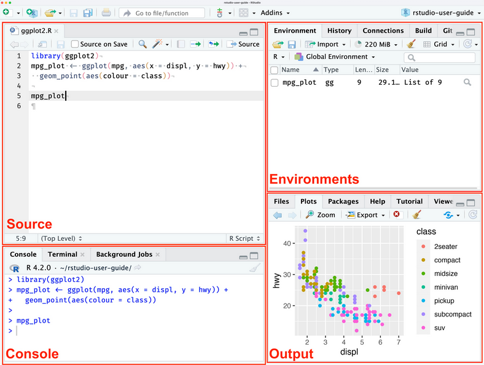

Estimated time: 30 mins, Updated July 2022

### Overview and Prerequisites
<strong>R</strong> and <strong>RStudio</strong> are two separate pieces of software:
 
<strong>R</strong> is a programming language that is especially powerful for data exploration, visualization, and statistical analysis. 
<strong>RStudio</strong> is an integrated development environment (IDE) that makes using R easier. In this course we use RStudio to interact with R. 
This page contains the set of instructions to be completed before beginning the module. By the end of these setup steps, you will have:

The R programming language installed  
RStudio installed and accessible on your computer  
The R packages required for this module  
The sample data required for this module  
{: .checklist}

### 1. Install R and RStudio

> ## Windows
> <strong>1a.</strong> Download the R installer for Windows from the [CRAN website](https://cran.rstudio.com/bin/windows/){:target="__blank"}. The latest version you should select is <strong>4.2.2</strong>. 
> <strong>1b.</strong> Double click the installer file, `R-4.2.2.exe`, in your downloads folder. R will be installed after this exe program runs. 
> <strong>1c.</strong> Go to the [RStudio download page](https://posit.co/download/rstudio-desktop). 
> <strong>1d.</strong> Under <strong>All Installers and Tarballs</strong>, locate and download the RStudio Installer for <strong>Windows</strong>. 
> <strong>1e.</strong> Double click the installer file, `RSTUDIO-2022.07.1+554.exe`, in your downloads folder. Use default settings while running the installer. 
> <strong>1f.</strong> Once RStudio is installed, open RStudio. 
{: .solution}

> ## MacOS
> <strong>1a.</strong> Download the R installer for macOS from the [CRAN website](https://cran.rstudio.com/bin/macosx/){:target="__blank"}. The latest version you should select is <strong>4.2.2</strong>. 
> <strong>1b.</strong> Double click the installer file, `R-4.2.2.pkg`, in your downloads folder. R will be installed after this pkg program runs. 
> <strong>1c.</strong> Download the XQuartz installer for macOS from the [XQuartz website](https://www.xquartz.org/){:target="__blank"}. The latest version you should select is <strong>2.8.4</strong>. 
> <strong>1d.</strong> Double click the installer file, `XQuartz-2.8.4.pkg`, in your downloads folder. Use default settings while running the installer. 
> <strong>1e.</strong> Go to the [RStudio download page](https://posit.co/download/rstudio-desktop){:target="__blank"}. 
> <strong>1f.</strong> Under <strong>All Installers and Tarballs</strong>, locate and download the RStudio Installer for <strong>macOS</strong>. 
> <strong>1g.</strong> Double click the installer file, `RSTUDIO-2022.07.1+554.pkg`, in your downloads folder. Use default settings while running the installer. 
> <strong>1h.</strong> Once RStudio is installed, open RStudio. 
{: .solution}

> ## Linux
> <strong>1a.</strong> Follow the instructions for your distribution on the [CRAN website](https://cran.r-project.org/){:target="__blank"}, they provide information on how to get the most recent version of R. The latest version you should select is <strong>4.2.2</strong>. 
> <strong>⚠</strong> For most distributions, we <strong>do not</strong> recommend using your package manager. The versions provided by this method are usually out of date. 
> <strong>1b.</strong> Go to the [RStudio download page](https://posit.co/download/rstudio-desktop){:target="__blank"}. 
> <strong>1c.</strong> Under <strong>All Installers and Tarballs</strong>, locate and download the RStudio Installer for your distribution. 
> <strong>1d.</strong> Install RStudio with your preferred method (such as, with Debian/Ubuntu `sudo dpkg -i rstudio-YYYY.MM.X-ZZZ-amd64.deb`). 
> <strong>1e.</strong> Once RStudio is installed, open RStudio. 
{: .solution}

### 2. Install required R packages
During the course we will need a number of R packages. Packages contain useful R code written by other people. We will use the packages tidyverse, hexbin, patchwork, and RSQLite. 

<strong>2a.</strong> To install these packages, navigate to your RStudio interface. Click inside the <strong>console</strong> window, you should see a blinking cursor. 

 

<strong>2b.</strong> Type the following line into your console and press <strong>Enter</strong> or <strong>Return</strong>:
~~~
install.packages(c("tidyverse", "hexbin", "patchwork", "RSQLite"))
~~~
{: .language-r}
 
<strong>2c.</strong> The `install.packages` command will have installed the list of R packages we gave it. Load the R packages into your environment by typing the following line into your console. Press <strong>Enter</strong> or <strong>Return</strong>:
~~~
library(tidyverse)
library(hexbin)
library(patchwork)
library(RSQLite)
~~~
{: .language-r}
 

It is recommended to keep your R version and all packages up to date. New versions bring improvements and important bugfixes.  
To update R packages, navigate to the menu located at the top of your RStudio interface. Click <strong>Tools</strong> > <strong>Check for Package Updates....</strong>. 
{: .callout}

### 3. Data Download

This module uses an instructional dataset, palmerpenguins from [CRAN](https://cran.r-project.org/){:target="__blank"}. To download the data this module uses, run the following lines in your console:
~~~
install.packages("palmerpenguins")
~~~
{: .language-r}
~~~
library(palmerpenguins)
~~~
{: .language-r}
Data Citation:

Horst AM, Hill AP, Gorman KB (2020). palmerpenguins: Palmer  
Archipelago (Antarctica) penguin data. R package version 0.1.0.  
https://allisonhorst.github.io/palmerpenguins/


